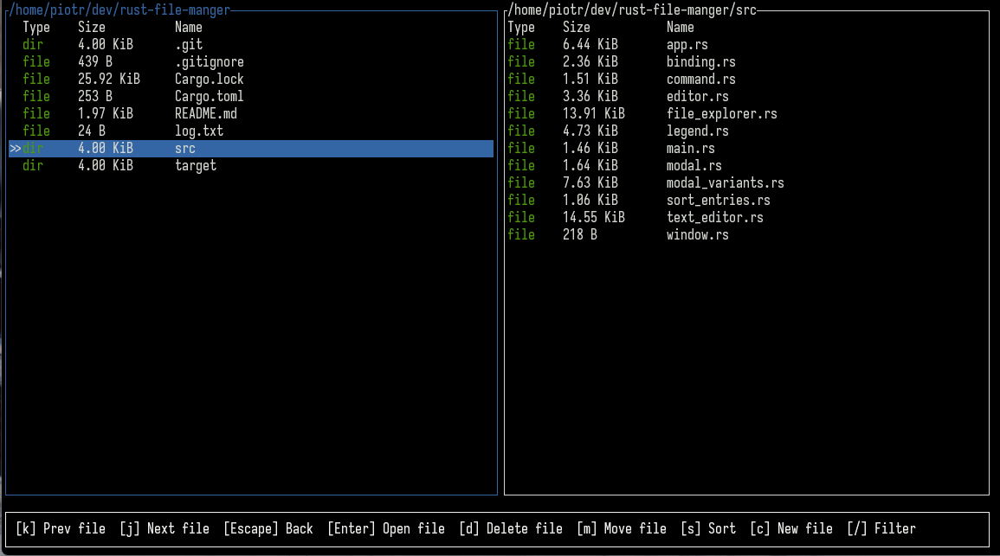
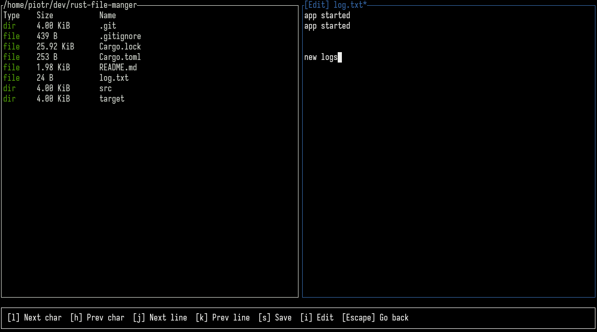

# RustFileManager

## Browsing directories


## Simple text editor


## Authors

+ [Krzysztof Kapera](https://github.com/krzkapera)
+ [Piotr Karamon](https://github.com/pkaramon)

## Installation

```bash
# Clone the repository
git clone https://github.com/pkaramon/rust-file-manager.git

# Navigate to project directory
cd rust-file-manager

# Build the project
cargo build --release

# Run the application
cargo run --release
```

## Features

+ navigating through directories using two panels
+ create/move/delete files and directories
+ sorting by name, size, modification date
+ simple vi-like text editor for text files
+ searching for files and directories
